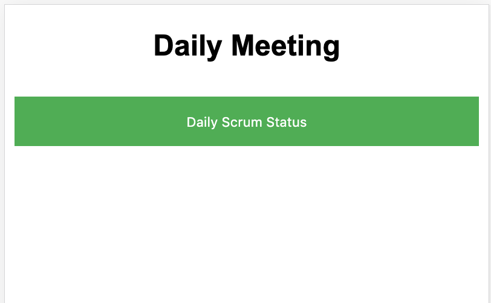
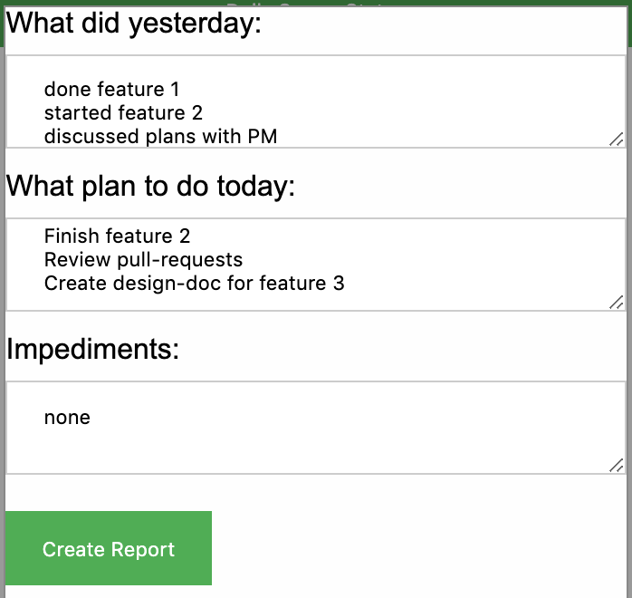
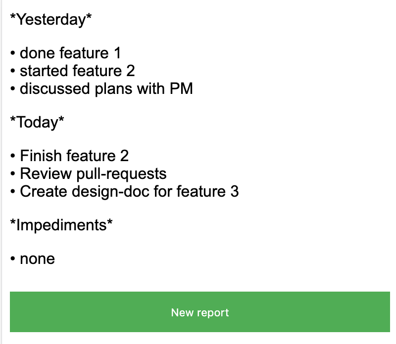

[](https://golang.org/doc/devel/release.html)
[![Go [lint, test]](https://github.com/obalunenko/scrum-report/actions/workflows/go.yml/badge.svg)](https://github.com/obalunenko/scrum-report/actions/workflows/go.yml)
[](https://github.com/obalunenko/scrum-report/actions/workflows/release.yml)
[](https://goreportcard.com/report/github.com/obalunenko/scrum-report)
[](https://sonarcloud.io/dashboard?id=oleg-balunenko_scrum-report)
[](https://godoc.org/github.com/obalunenko/scrum-report)
[](https://github.com/obalunenko/scrum-report/releases/latest)
[](https://hub.docker.com/r/olegbalunenko/scrum-report)
[](/LICENSE)

# scrum-report

Daily stand up meeting scrum report generator in markdown format for slack

## Template

    ```text
        *What did I do*
        •
        *What will I do*
        •
        *Impediments*
        •
    ```

## Usage of scrum-report

1. Download executable
   file: [](https://github.com/obalunenko/scrum-report/releases/latest)
2. Unrar archive.
3. a. Run executable `scrum-report` with necessary flags. (see bellow list of available flags)
   b. Run docker-compose `docker-compose -f ./docker-compose.yml up --build -d`
   c. Pull image from docker and run it with set ENV variables (see bellow list of available variables)

Environment variables used:

```env
    SCRUM_REPORT_APP_PORT: Application listen port.
    SCRUM_REPORT_APP_NAME: Application service name
    SCRUM_REPORT_LOG_LEVEL: Outout log level
    SCRUM_REPORT_LOG_FORMAT: Log format (json or text)
    SCRUM_REPORT_LOG_SENTRY_DSN: Sentry DSN, if empty - disabled
    SCRUM_REPORT_LOG_SENTRY_TRACE_ENABLE: Enable sentry tracing.
    SCRUM_REPORT_LOG_SENTRY_TRACE_LEVEL: Sentry Tracing level.
```

Flags used:

```bash
  -help bool
        Output help for usage.
  -app_name string
    	app service name (default "scrum-report")
  -app_port string
    	app port (default "8080")
  -log_format string
    	Format of logs (supported values: text, json (default "text")
  -log_level string
    	set log level of application (default "INFO")
  -log_sentry_dsn string
    	Sentry DSN
  -log_sentry_trace_enable
    	Enables sending stacktrace to sentry
  -log_sentry_trace_level string
    	The level at which to start capturing stacktraces (default "PANIC")
```

#### Demo






