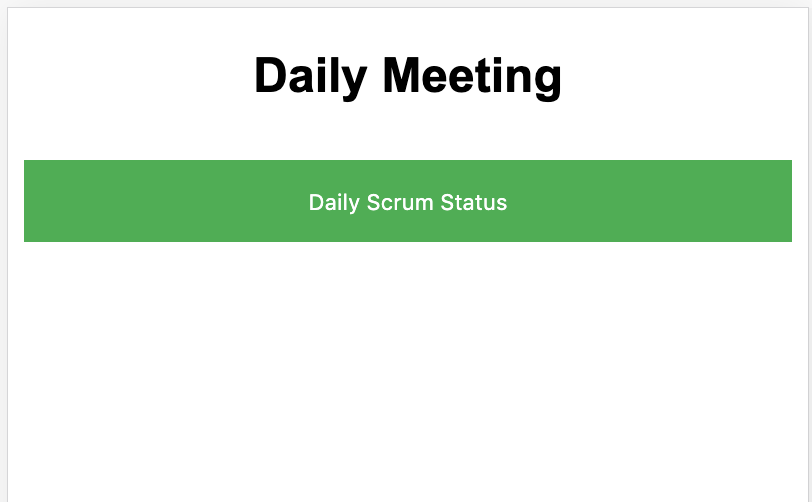
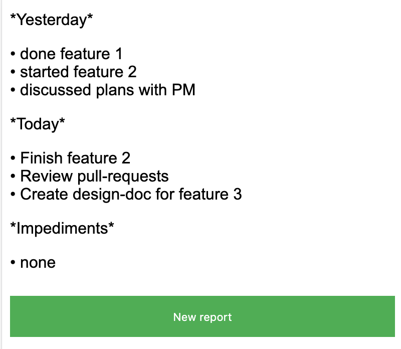

# scrum-report

[](https://travis-ci.org/oleg-balunenko/scrum-report)
[](https://goreportcard.com/report/github.com/oleg-balunenko/scrum-report)
[](https://github.com/oleg-balunenko/scrum-report/releases/latest)
[](https://sonarcloud.io/dashboard?id=oleg-balunenko_scrum-report)

Daily stand up meeting scrum report generator in markdown format for slack

## Template:

```text
*Yesterday*
•
*Today*
•
*Impediments*
•
```

## Usage of scrum-report

Download binary from [](https://github.com/oleg-balunenko/scrum-report/releases/latest)
and execute
Following parameters could be configured:

```text
   -host_address string
          address of host (default "localhost")
    -listen_port string
          listen port (default "8080")
    -log_level string
          log level (default "INFO")
    -open_browser
          open browser after start on index page

```

Then open in browser page `localhost:8080` and start to us it

### Demo





